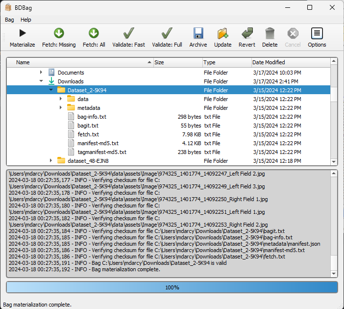

# BDBag GUI

Graphical User Interface for [bdbag](https://github.com/fair-research/bdbag) written in [PyQt5](https://www.riverbankcomputing.com/software/pyqt/download5).

Pre-compiled bundles of the application for Windows and MacOSX can be found [here](https://github.com/ini-bdds/bdbag_gui/releases).

*  MacOSX minimum supported version: 10.13.x (High Sierra)
*  Windows minimum supported version: 10.x
    *  `NOTE`: Fully patched versions of Windows 7 may also be compatible but are not officially supported.

